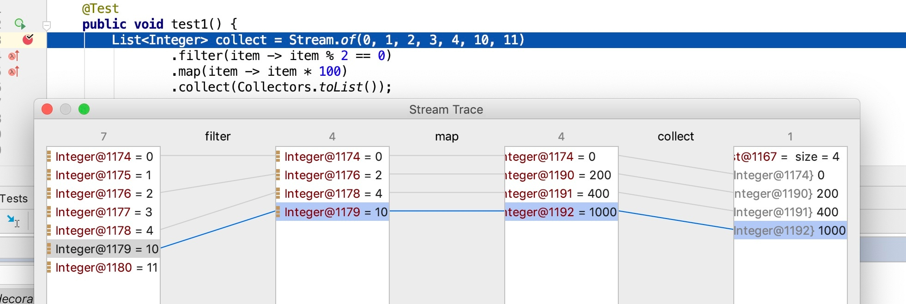
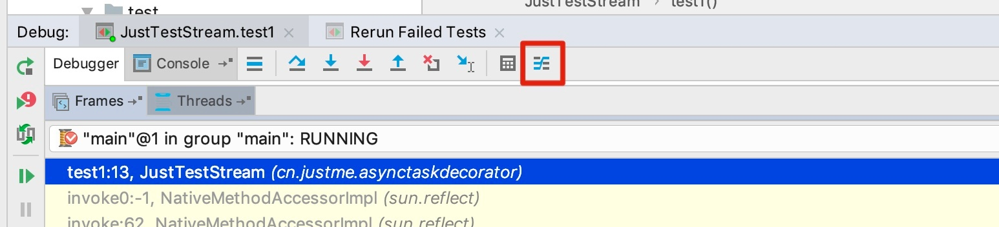

# 更好的调试 Java Stream

举个简单的例子

```java
List<Integer> collect = Stream.of(0, 1, 2, 3, 4, 10, 11)
                .filter(item -> item % 2 == 0)
                .map(item -> item * 100)
                .collect(Collectors.toList());
```

这段代码想做的就是找出一组数据中的偶数，并把找出来的偶数扩大100倍。

如果我们想了解stream的流水线操作，每个操作后的结果是什么，我们像其他代码一样去用ide工具debug也不好使。在此我们可以想到用`peek()`去打印出每个操作后的结果，如下：

```text
List<Integer> collect = Stream.of(0, 1, 2, 3, 4, 10, 11)
              .filter(item -> item % 2 == 0)
              .peek(System.out::println)
              .map(item -> item * 100)
              .peek(System.out::println)
              .collect(Collectors.toList());
```

输出结果：

```text
0
0
2
200
4
400
10
1000
```

这样虽然能够达到目的，但是IntelliJ’s debugger 给我们更加形象化的表示：



**使用IntelliJ’s debugger步骤**

**第1步 想调用`stream debugger`的话，首先要在`Stream`定义处设置断点**

**第2步 以`debug`模式运行代码**

**第3步 当到达断点时，可以按如下图指定的按钮来调用 Stream debugger，如下：**



OK，大功告成。

