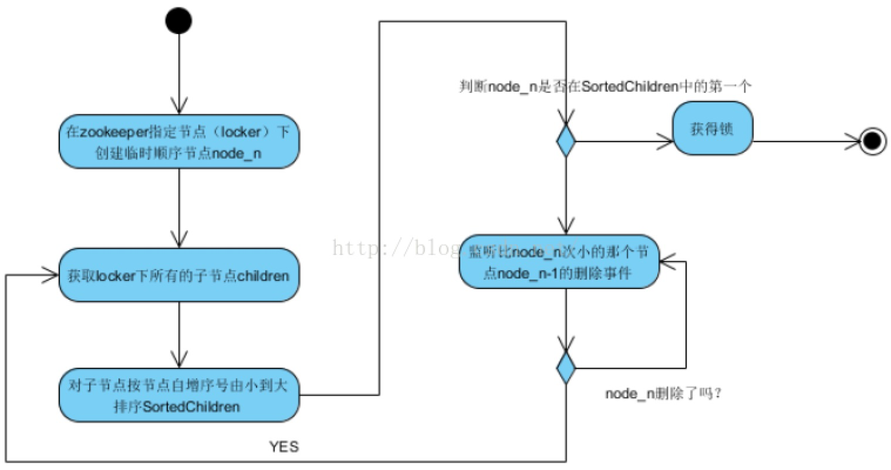

# Spring Could中基于Zookeeper的分布式锁实现

### Zookeeper中的2个重要特性 <a id="SpringCould&#x4E2D;&#x57FA;&#x4E8E;Zookeeper&#x7684;&#x5206;&#x5E03;&#x5F0F;&#x9501;&#x5B9E;&#x73B0;-Zookeeper&#x4E2D;&#x7684;2&#x4E2A;&#x91CD;&#x8981;&#x7279;&#x6027;"></a>

#### 1、Zookeeper的文件文件系统 <a id="SpringCould&#x4E2D;&#x57FA;&#x4E8E;Zookeeper&#x7684;&#x5206;&#x5E03;&#x5F0F;&#x9501;&#x5B9E;&#x73B0;-1&#x3001;Zookeeper&#x7684;&#x6587;&#x4EF6;&#x6587;&#x4EF6;&#x7CFB;&#x7EDF;"></a>

每个子目录项如 NameService 都被称作为znode，和文件系统一样，我们能够自由的增加、删除znode，在一个znode下增加、删除子znode，唯一的不同在于znode是可以存储数据的。 znode下的value默认最大为1M，可以通过配置文件修改。有四种类型的znode：

* PERSISTENT-持久化目录节点  客户端与zookeeper断开连接后，该节点依旧存在
* PERSISTENT\_SEQUENTIAL-持久化顺序编号目录节点  客户端与zookeeper断开连接后，该节点依旧存在，只是Zookeeper给该节点名称进行顺序编号
* EPHEMERAL-临时目录节点  客户端与zookeeper断开连接后，该节点被删除
* EPHEMERAL\_SEQUENTIAL-临时顺序编号目录节点 客户端与zookeeper断开连接后，该节点被删除，只是Zookeeper给该节点名称进行顺序编号

#### 2、Zookeeper通知机制 <a id="SpringCould&#x4E2D;&#x57FA;&#x4E8E;Zookeeper&#x7684;&#x5206;&#x5E03;&#x5F0F;&#x9501;&#x5B9E;&#x73B0;-2&#x3001;Zookeeper&#x901A;&#x77E5;&#x673A;&#x5236;"></a>

客户端注册监听它关心的目录节点，当目录节点发生变化（数据改变、被删除、子目录节点增加删除）时，zookeeper会通知客户端。

### 基于Zookeeper分布式锁的实现原理 <a id="SpringCould&#x4E2D;&#x57FA;&#x4E8E;Zookeeper&#x7684;&#x5206;&#x5E03;&#x5F0F;&#x9501;&#x5B9E;&#x73B0;-&#x57FA;&#x4E8E;Zookeeper&#x5206;&#x5E03;&#x5F0F;&#x9501;&#x7684;&#x5B9E;&#x73B0;&#x539F;&#x7406;"></a>

利用Zookeeper的以上2个特性，基于Zookeeper的分布式锁的实现大概有3中方式：

#### 1、方案一：利用Zookeeper中节点的唯一性来实现 <a id="SpringCould&#x4E2D;&#x57FA;&#x4E8E;Zookeeper&#x7684;&#x5206;&#x5E03;&#x5F0F;&#x9501;&#x5B9E;&#x73B0;-1&#x3001;&#x65B9;&#x6848;&#x4E00;&#xFF1A;&#x5229;&#x7528;Zookeeper&#x4E2D;&#x8282;&#x70B9;&#x7684;&#x552F;&#x4E00;&#x6027;&#x6765;&#x5B9E;&#x73B0;"></a>

Zookeeper中的节点具有唯一性，利用这一特性，客户端只需要循环创建同一个节点\(临时节点\)，创建成功即表示获取了锁，创建失败则自旋。这种方案的正确性和可靠性是ZooKeeper机制保证的，实现简单。缺点是会产生“惊群”效应，假如许多客户端在等待一把锁，当锁释放时候所有客户端都被唤醒，仅仅有一个客户端得到锁。

#### 2、方案二：利用临时顺序节点实现 <a id="SpringCould&#x4E2D;&#x57FA;&#x4E8E;Zookeeper&#x7684;&#x5206;&#x5E03;&#x5F0F;&#x9501;&#x5B9E;&#x73B0;-2&#x3001;&#x65B9;&#x6848;&#x4E8C;&#xFF1A;&#x5229;&#x7528;&#x4E34;&#x65F6;&#x987A;&#x5E8F;&#x8282;&#x70B9;&#x5B9E;&#x73B0;"></a>

* 客户端调用create\(\)方法创建名为“locknode/guid-lock-”的节点，需要注意的是，这里节点的创建类型需要设置为EPHEMERAL\_SEQUENTIAL。
* 客户端调用getChildren\(“locknode”\)方法来获取所有已经创建的子节点，同时在这个节点上注册上子节点变更通知的Watcher。
* 客户端获取到所有子节点path之后，如果发现自己在步骤1中创建的节点是所有节点中序号最小的，那么就认为这个客户端获得了锁。
* 如果在步骤3中发现自己并非是所有子节点中最小的，说明自己还没有获取到锁，就开始等待，直到下次子节点变更通知的时候，再进行子节点的获取，判断是否获取锁。

由于这种方案下，客户端依然要关注和自己无关的事件，所以并没有避免“惊群现象”。进一步思考，我们只需要判断自己是否是所有节点中序号最小的，于是，很容易可以联想的到的是，每个节点的创建者只需要关注比自己序号小的那个节点，儿无须关注所有的节点

#### 3、方案三：利用临时顺序节点的改进实现 <a id="SpringCould&#x4E2D;&#x57FA;&#x4E8E;Zookeeper&#x7684;&#x5206;&#x5E03;&#x5F0F;&#x9501;&#x5B9E;&#x73B0;-3&#x3001;&#x65B9;&#x6848;&#x4E09;&#xFF1A;&#x5229;&#x7528;&#x4E34;&#x65F6;&#x987A;&#x5E8F;&#x8282;&#x70B9;&#x7684;&#x6539;&#x8FDB;&#x5B9E;&#x73B0;"></a>

* 创建一个永久节点作为锁节点，试图加锁的客户端在锁节点下创建临时顺序节点。Zookeeper会保证子节点的有序性。
* 若锁节点下id最小的节点是为当前客户端创建的节点，说明当前客户端成功加锁。
* 否则加锁失败，订阅上一个顺序节点。当上一个节点被删除时，当前节点为最小，说明加锁成功。
* 操作完成后，删除锁节点释放锁。

使用该方案不但可以有效的避免“惊群现象”，同时由于该方案优先排队等待的客户端会先获得锁，所以也实现了公平锁



#### 直接使用Zookeeper客户端的代码实现 <a id="SpringCould&#x4E2D;&#x57FA;&#x4E8E;Zookeeper&#x7684;&#x5206;&#x5E03;&#x5F0F;&#x9501;&#x5B9E;&#x73B0;-&#x76F4;&#x63A5;&#x4F7F;&#x7528;Zookeeper&#x5BA2;&#x6237;&#x7AEF;&#x7684;&#x4EE3;&#x7801;&#x5B9E;&#x73B0;"></a>

```java
package zk;
 
import java.util.ArrayList;
import java.util.Arrays;
import java.util.Collections;
import java.util.List;
import java.util.concurrent.ExecutorService;
import java.util.concurrent.Executors;
 
import org.apache.commons.lang3.StringUtils;
import org.apache.zookeeper.*;
 
/**
 * @author finley
 */
public class ZKLock {
 
    private ZooKeeper zk;
 
    private String basePath;
 
    private String lockPath;
 
    private static final byte[] LOCK_DATA = "".getBytes();
 
    // zk 为客户端连接实例, basePath 为锁节点路径，我们将在 basePath 下创建顺序子节点
    public ZKLock(ZooKeeper zk, String basePath) {
        // 按照 zk 的路径规则，以'/'开始，不得以'/'结束
        if (basePath.endsWith("/") || !basePath.startsWith("/")) {
            throw new IllegalArgumentException("base path must start with '/', and must not end with '/'");
        }
        this.zk = zk;
        this.basePath = basePath;
    }
 
    // 检测 basePath 节点是否存在, 若不存在则创建
    private void ensureBasePath() throws KeeperException, InterruptedException {
        if (zk.exists(basePath, false) == null) {
            // basePath 不存在，进行创建
            List<String> pathParts = new ArrayList<>(Arrays.asList(basePath.split("/"))); // 将路径处理为节点列表
            pathParts.remove(0); //因为 basePath 以'/'开始, pathParts[0] 一定是空串，将其移除
 
            // 自底向上，寻找路径中最后一个存在的节点
            int last = 0;
            for (int i = pathParts.size() - 1; i >= 0; i--) {
                String path = "/" + StringUtils.join(pathParts.subList(0, i), '/');
                if (zk.exists(path, false) != null) {
                    last = i;
                    break;
                }
            }
 
            // 从最后一个存在的节点开始，依次创建节点
            for (int i = last; i < pathParts.size(); i++) {
                String path = "/" + StringUtils.join(pathParts.subList(0, i + 1), '/');
                try {
                    zk.create(path, LOCK_DATA, ZooDefs.Ids.OPEN_ACL_UNSAFE, CreateMode.PERSISTENT);
                } catch (KeeperException.NodeExistsException ignore) {} // may created by other thread
            }
 
        }
    }
 
    // 阻塞直至加锁成功
    public void lock() throws KeeperException, InterruptedException {
        ensureBasePath();
 
        // 在 basePath 下创建临时顺序子节点
        String lockPath = zk.create(basePath + "/lock_", LOCK_DATA, ZooDefs.Ids.OPEN_ACL_UNSAFE, CreateMode.EPHEMERAL_SEQUENTIAL);
 
        System.out.println(Thread.currentThread().getName() + " create: " + lockPath);
 
        // 循环检查加锁是否成功
        while(true) {
            // 取出 basePath 中所有节点并找到最小子节点
            // 因为顺序子节点总是递增的，新创建的节点一定比当前 lockPath 更大，所以 create 和 getChildren 两个操作不保持原子性不会出现异常
            List<String> children = zk.getChildren(basePath,false);
            Collections.sort(children);
            String minNode = children.get(0);
 
            // 当前线程创建了最小子节点，加锁成功
            if (StringUtils.isNotBlank(lockPath) && StringUtils.isNotBlank(minNode) && StringUtils.equals(lockPath, basePath + "/" + minNode) {
                this.lockPath = lockPath; // 加锁成功，写入锁路径
                return;
            }
 
            // 加锁失败，设置 watch
            String watchNode = null;
            String node = lockPath.substring(lockPath.lastIndexOf("/") + 1);
            for (int i = children.size() - 1; i >= 0; i--) {
                String child = children.get(i);
                if (child.compareTo(node) < 0) {
                    watchNode = child;
                    break;
                }
            }
 
            // 找到需要监视的节点，设置 watch
            if (watchNode != null) {
                System.out.println(Thread.currentThread().getName() + " watch: " + watchNode);
 
                String watchPath = basePath + "/" + watchNode;
                 
                // 监视 getData 而非 exists 的原因是: 在获取子节点和设置 watch 这段时间内，被监视的节点可能已被删除(锁释放/持有者崩溃)
                // exists 监视会成功设置，但永远不会触发NodeDeleted事件(顺序子节点序号自增，不会复用使用过的序号)。本方法会无限制等待下去
                // 若被监视节点已删除，getData 会抛出异常，避免线程浪费时间等待
 
                // 该调用中的 watch 回调当事件发生时会在另一个线程中执行
                try {
                    zk.getData(watchPath, event -> {
                        if(event.getType() == Watcher.Event.EventType.NodeDeleted) {
                            // 主线程会调用 this.wait()
                            // fixme: 这里有一个bug，若事件类型不是 NodeDeleted 应进行处理。分布式锁不会产生这种情况，可能是其它客户端操作所致
                            synchronized (this) {
                                notifyAll();
                            }
                        }
                    }, null);
                } catch(KeeperException.NoNodeException e) {
                    // 因为上一个节点被删除导致 getData watch 失败，进入下一个次循环，重新检查自己是否已持有锁
                    continue;
                }
         
 
                synchronized (this) {
                    // 等待被 watch 唤醒，唤醒后进入下一次循环，重新检查确认自己已持有锁
                    wait();
                    System.out.println(Thread.currentThread().getName() + " notified");
                }
            }
        }   
 
    }
 
    // 释放锁
    public void unlock() throws KeeperException, InterruptedException {
        // 加锁成功时会将锁路径写入 lockPath
        if (StringUtils.isNotBlank(lockPath)) {
            zk.delete(lockPath, -1); // 删除锁记录释放锁
        } else {
            throw new IllegalStateException("don't has lock"); // 未设置锁记录说明本线程未持有锁
        }
    }
 
    public static void main(String[] args) {
        int concurrent = 10;
        ExecutorService service = Executors.newFixedThreadPool(concurrent);
        for (int i = 0; i < concurrent; i++) {
            service.execute(() -> {
                // 为保证各线程独立的持有锁，每个线程应持有独立的 zookeeper 会话
                ZooKeeper zk;
                try {
 
                    zk = new ZooKeeper("localhost:2181", 6000, watchedEvent -> {
                        if (Watcher.Event.KeeperState.SyncConnected == watchedEvent.getState())
                            System.out.println("connection is established...");
                    });
 
                    ZKLock lock = new ZKLock(zk, "/test/node1");
 
                    lock.lock();
                    System.out.println(Thread.currentThread().getName() + "  acquire success");
 
                    Thread.sleep(1000);
                    System.out.println("do sth, thread: " + Thread.currentThread().getName());
 
                    lock.unlock();
                    System.out.println(Thread.currentThread().getName() + "  release success");
 
                } catch (Exception e) {
                    e.printStackTrace();
                }
            });
        }
        service.shutdown();
    }
}
```

### 使用Curator的实现 <a id="SpringCould&#x4E2D;&#x57FA;&#x4E8E;Zookeeper&#x7684;&#x5206;&#x5E03;&#x5F0F;&#x9501;&#x5B9E;&#x73B0;-&#x4F7F;&#x7528;Curator&#x7684;&#x5B9E;&#x73B0;"></a>

Cruator 是一个 Zookeeper 工具集, 提供了包括分布式锁在内的常用应用的封装，使用Curator中的分布式锁非常简单。Cruator中分布式锁的实现原理基本和上述中的方案3一直

```java
public class ZkLock {
 
    public static void main(String[] args) throws Exception {
        RetryPolicy retryPolicy = new ExponentialBackoffRetry(1000, 3);
        CuratorFramework client = CuratorFrameworkFactory.newClient("localhost:2181", retryPolicy);
        client.start();
 
        // 锁节点为 /curator/mutex
        InterProcessMutex mutex = new InterProcessMutex(client, "/curator/mutex");
        try {
            // 尝试加锁
            mutex.acquire();
            // 完成业务
            System.out.println("foo bar");
        } finally {
            // 释放锁
            mutex.release();
            client.close();
        }
 
    }
}

```

### 优点： <a id="SpringCould&#x4E2D;&#x57FA;&#x4E8E;Zookeeper&#x7684;&#x5206;&#x5E03;&#x5F0F;&#x9501;&#x5B9E;&#x73B0;-&#x4F18;&#x70B9;&#xFF1A;"></a>

1. 锁释放：使用Zookeeper可以有效的解决锁无法释放的问题，因为在创建锁的时候，客户端会在ZK中创建一个临时节点，一旦客户端获取到锁之后突然挂掉（Session连接断开），那么这个临时节点就会自动删除掉。其他客户端就可以再次获得锁。
2. 非阻塞锁：使用Zookeeper可以实现阻塞的锁，客户端可以通过在ZK中创建顺序节点，并且在节点上绑定监听器，一旦节点有变化，Zookeeper会通知客户端，客户端可以检查自己创建的节点是不是当前所有节点中序号最小的，如果是，那么自己就获取到锁，便可以执行业务逻辑了。
3. 可重入锁：使用Zookeeper也可以有效的解决不可重入的问题，客户端在创建节点的时候，把当前客户端的主机信息和线程信息直接写入到节点中，下次想要获取锁的时候和当前最小的节点中的数据比对一下就可以了。如果和自己的信息一样，那么自己直接获取到锁，如果不一样就再创建一个临时的顺序节点，参与排队。
4. 单点问题：使用Zookeeper可以有效的解决单点问题，ZK是集群部署的，只要集群中有半数以上的机器存活，就可以对外提供服务。

### 缺点： <a id="SpringCould&#x4E2D;&#x57FA;&#x4E8E;Zookeeper&#x7684;&#x5206;&#x5E03;&#x5F0F;&#x9501;&#x5B9E;&#x73B0;-&#x7F3A;&#x70B9;&#xFF1A;"></a>

Zookeeper实现的分布式锁其实存在一个缺点，那就是性能上可能并没有缓存服务那么高。这是由Zookeeper高一致性决定的，因为每次在创建锁和释放锁的过程中，都要动态创建、销毁瞬时节点来实现锁功能。ZK中创建和删除节点只能通过Leader服务器来执行，然后将数据同不到所有的Follower机器上。

### 常见问题 <a id="SpringCould&#x4E2D;&#x57FA;&#x4E8E;Zookeeper&#x7684;&#x5206;&#x5E03;&#x5F0F;&#x9501;&#x5B9E;&#x73B0;-&#x5E38;&#x89C1;&#x95EE;&#x9898;"></a>

#### 羊群效应\(Herd Effect\)/惊群现象 <a id="SpringCould&#x4E2D;&#x57FA;&#x4E8E;Zookeeper&#x7684;&#x5206;&#x5E03;&#x5F0F;&#x9501;&#x5B9E;&#x73B0;-&#x7F8A;&#x7FA4;&#x6548;&#x5E94;(HerdEffect)/&#x60CA;&#x7FA4;&#x73B0;&#x8C61;"></a>

举一个很简单的例子，当你往一群鸽子中间扔一块食物，虽然最终只有一个鸽子抢到食物，但所有鸽子都会被惊动来争夺，没有抢到食物的鸽子只好回去继续睡觉， 等待下一块食物到来。这样，每扔一块食物，都会惊动所有的鸽子，即为惊群。对于操作系统来说，多个进程/线程在等待同一资源是，也会产生类似的效果，其结 果就是每当资源可用，所有的进程/线程都来竞争资源，造成的后果：  
1）系统对用户进程/线程频繁的做无效的调度、上下文切换，系统系能大打折扣。  
2）为了确保只有一个线程得到资源，用户必须对资源操作进行加锁保护，进一步加大了系统开销。

### 参考 <a id="SpringCould&#x4E2D;&#x57FA;&#x4E8E;Zookeeper&#x7684;&#x5206;&#x5E03;&#x5F0F;&#x9501;&#x5B9E;&#x73B0;-&#x53C2;&#x8003;"></a>

1、Zookeeper官方实现：[https://github.com/apache/curator](https://github.com/apache/curator)

2、惊群现象：[https://blog.csdn.net/tuantuanls/article/details/41205739](https://blog.csdn.net/tuantuanls/article/details/41205739)

3、zookeeper分布式锁原理：[http://www.cnblogs.com/linjiqin/p/6052031.html](http://www.cnblogs.com/linjiqin/p/6052031.html)

