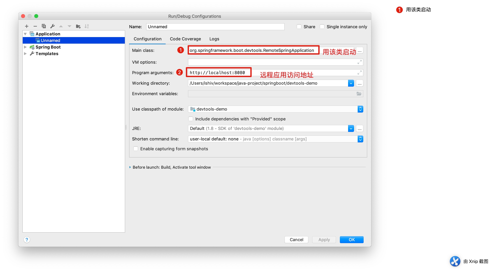

# Springboot devtool远程应用功能

这里主要介绍一下，远程应用的特性。采用springboot版本为2.0.6.RELEASE

**一. 引入devtools**

1. maven

```markup
<dependencies>
  <dependency>
    <groupId>org.springframework.boot</groupId> 
    <artifactId>spring-boot-devtools</artifactId> 
    <optional>true</optional>
  </dependency>
</dependencies>
```

2. gradle

```groovy
dependencies {
    compile("org.springframework.boot:spring-boot-devtools")
}
```

**二. 开启远程功能**

Spring Boot developer工具并不局限于本地开发。在远程运行应用程序时，还可以使用几个特性。要启用远程支持，需要确保devtools包含在重新打包的归档文件中，如下：

```markup

<build>
     <plugins>
        <plugin>
            <groupId>org.springframework.boot</groupId>
            <artifactId>spring-boot-maven-plugin</artifactId>
            <configuration>
                <excludeDevtools>false</excludeDevtools>
            </configuration>
        </plugin>
    </plugins>
</build>
```

远程devtools支持分两部分提供:接受连接的服务器端端点和在IDE中运行的客户端应用程序。当设置了`spring.devtools.remote.secret`属性时，服务器组件将自动启用。客户端组件必须手动启动。

配置`spring.devtools.remote.secret`属性

| [`spring.devtools.remote.secret=shi`](https://wiki.dycjr.net:1443/pages/spring.devtools.remote.secret=shi) |
| :--- |


_**注意：在远程应用程序上启用spring-boot-devtools存在安全风险。不应该在生产部署上启用支持。**_

**三. 打包你的应用**

写一个简单的controller

```java

@RestController
public class IndexController {
 
    @GetMapping("hello")
    public String hello() {
        System.out.println("hello");
        return "hello";
    }
}
```

然后`mvn clean package` 生产jar文件

运行jar：`devtools-demo-0.0.1-SNAPSHOT.jar`\(因为没有远程环境，在本地模拟一下\)

浏览器访问


**四. 运行你的远程客户端**

在你的IDE（我用的是Idea）里启动你的代码，操作步骤：

1、在菜单栏选择 run &gt; edit configrations

2、如下图



3、启动

```bash
......
.   ____          _                                              __ _ _
 /\\ / ___'_ __ _ _(_)_ __  __ _          ___               _      \ \ \ \
( ( )\___ | '_ | '_| | '_ \/ _` |        | _ \___ _ __  ___| |_ ___ \ \ \ \
 \\/  ___)| |_)| | | | | || (_| []::::::[]   / -_) '  \/ _ \  _/ -_) ) ) ) )
  '  |____| .__|_| |_|_| |_\__, |        |_|_\___|_|_|_\___/\__\___|/ / / /
 =========|_|==============|___/===================================/_/_/_/
 :: Spring Boot Remote ::  (v2.0.6.RELEASE)
 
.....
```

然后选择菜单build &gt; build project

控制台输入增加了下面两行提示：

```bash
2018-10-26 23:15:41.661  INFO 6430 --- [   File Watcher] o.s.b.d.r.c.ClassPathChangeUploader      : Uploaded 1 class resource
2018-10-26 23:15:43.057  INFO 6430 --- [pool-1-thread-1] o.s.b.d.r.c.DelayedLiveReloadTrigger     : Remote server has changed, triggering LiveReload
```

浏览器再次访问：


发现我们部署的代码也已经自动更新了。

